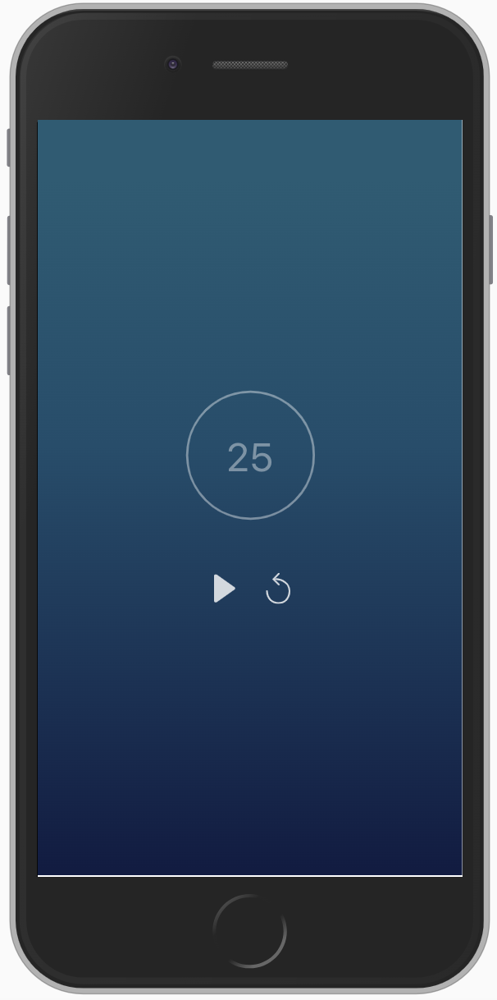
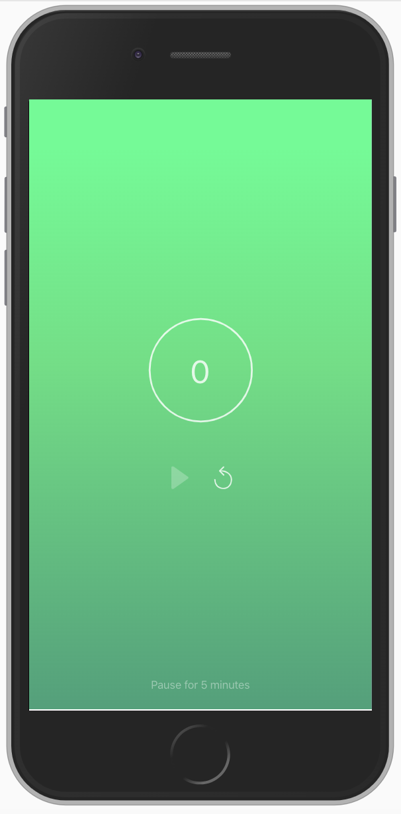

# Description

This project is about providing a simple, clean 25-minutes-timer for following the Pomodoro technique.

At the current state this web application is used best in a multi-monitor setup: on one screen (e.g. a laptop screen), this application could be running, while the other monitors can be used for working.
The app design is focused on avoiding distraction until the time is over (after 25 minutes).

# Roadmap

- [ ] use styled components:
  - https://www.styled-components.com/docs/basics#installation
  - refactor components (IconButton)
- [ ] add browser notifications
- [ ] allow activating a 5 min "pause" round (button next to the pause hint text)
