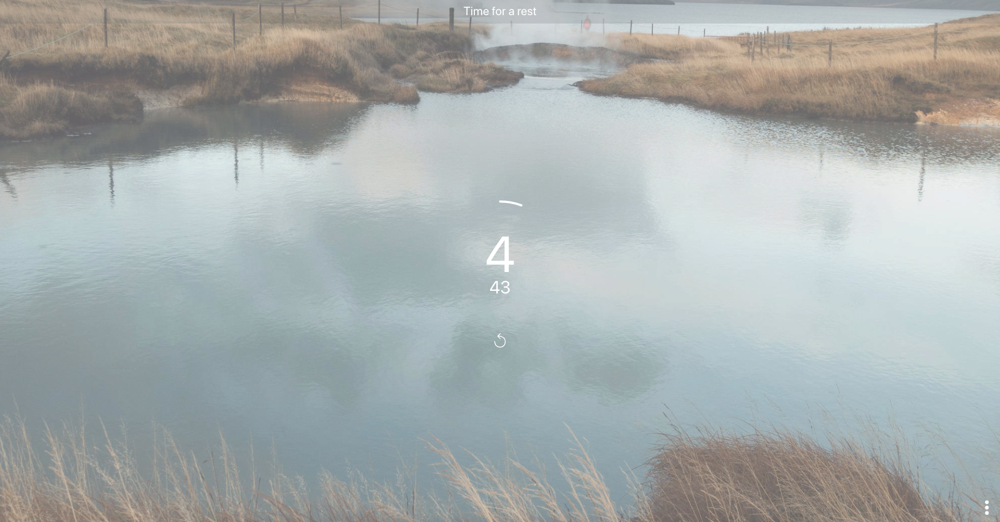

# Description

"Calm Focus" is a simple and clean timer which will improve your focus on any task.

Try it out: [Calm Focus](https://ecstatic-noether-623282.netlify.app/)

The concept is partially based on the principles of the well-known [Pomodoro technique](https://en.wikipedia.org/wiki/Pomodoro_Technique):

1. Focus (~25 min.)
2. Rest (~5 min.)
3. Repeat 1.-2. about four times. The fourth rest phase shall be longer.
4. Continue with 1.

Here's a short list that summarizes the features and use cases:

- Improve your focus and plan rest times
- Clean design avoids distraction until time is over
  - Will enable you to continue longer focus periods when you switch notifications off
  - Good to use in multi-monitor setup - e.g. use laptop screen for this timer.
- Configurable: many options to fit individual requirements
  - Work focus timer
  - HIIT workout timer (especially when auto-continue is activated)
  - Cooking timer
  - Meditation timer (sound will notify when time is over)
- Reactive: adjust configurations at anytime - e.g. increase focus duration even when time is already running
- Remembers your configurations (no login required, stored locally in your browser)
- Keyboard shortcuts for quicker configuration (Hover buttons to see which are available)
- Platform-independent web-app
- Installation possible on devices that support PWAs ([Progressive Web Apps](https://en.wikipedia.org/wiki/Progressive_web_application"))
- Browser notifications (visual and acoustic) when time is over
- Fast reload and offline usage, due to caching as PWA

# Screenshot

## Focus

## Rest

## Configure to your needs

# Side notes

I used this repository mainly for learning purposes - there are already many timers available. The reasons I still wanted to create my own where are that this type of project is small enough to be able to refactor it quickly, but complex enough to try out multiple programming patterns and technologies (e.g. React Context, Web Workers, WebAssembly, Service Worker, etc.). Furthermore it's quickly testable on multiple devices and browsers, so cross-browser/-device pecularities can be discovered quickly.

Some technical aspects that were touched with this project:

- React + almost all React Hooks, Typescript, Material UI, CSS-in-JS
  - tried out styled-components first, but switched to Material UI
- Progressive Web Application, Service Workers (for installation and offline/caching capability)
- Browser notification API
- Cross-browser/-device compatiblity
- Web Workers (for calculating passed seconds)
- Local Storage
- CI: Host with Netlify, deploy on Github commits on master
- Programming patterns
  - React useContext + useReducer as an alternative to Redux
  - Compound components
  - Custom Hooks
  - Observer pattern
- WebAssembly with Rust
  - I wanted to see if the setInterval could be implemented with WebAssembly/Rust well. It was possible and nice to try out, but there was no real benefit of it within this specific web app. That's why I removed it - for reference on how to integrate WebAssembly+Rust, see commit ([#bdadafe](https://github.com/mic-web/calm-focus/commit/bdadafef5d70b2a9727575e31a260b4f3d70c0f1)).

# Compatibility

I tested it on multiple devices and screens. Following browsers are supported:

- Firefox
- Chrome
- Safari

This webapp works basically also on mobile, but not when the mobile OS decides to pause it. This happens when the screen gets locked, or on iOS also when the browser is not opened. The app will only get privileges for working in background when installed as PWA (not available on iOS).
On most Android devices, the timer should continue to work as long as the screen won't get locked.

# Roadmap

I might add some more options in the future:

- When time is over, send an HTTP request to an endpoint of your choice (to integrate with other devices. Proxy on user side will be required to solve CORS issues)
- Configurable phases (e.g. a longer Rest phase)
