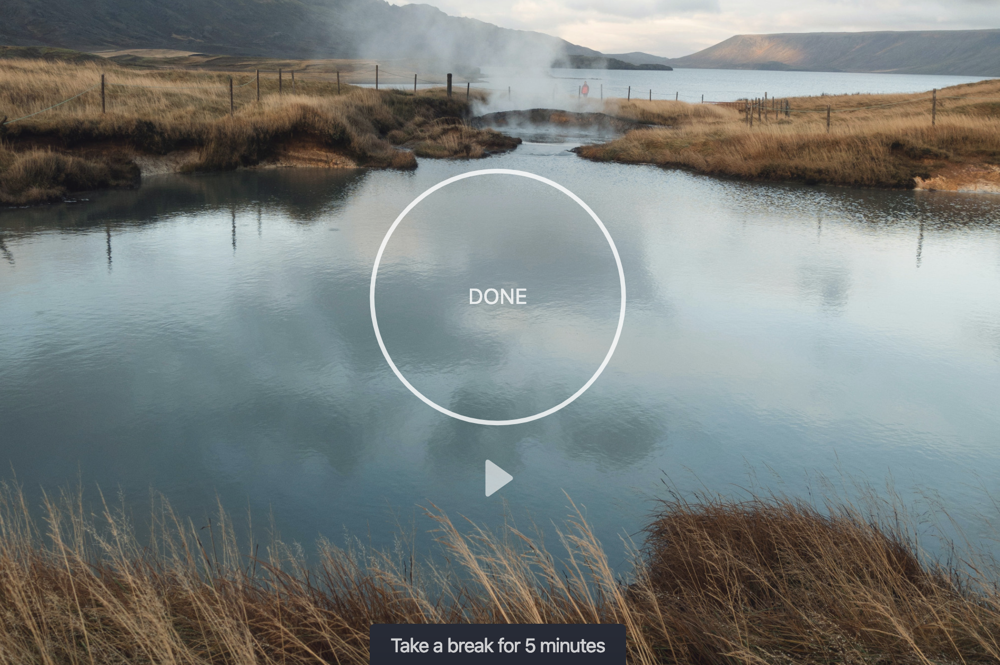

# Description

This projects provides a simple, clean 25-minutes-timer in the style of the Pomodoro technique.

The app design is focused on avoiding distraction until the time is over (after 25 minutes).
If you have enough screens available, it's encouraged to keep this app open on one side-screen, e.g. on the laptop, as it won't clame your attention until time is over.

# Features

- Smart and private memory: Remembers start time in browser so that you can continue with the timer if you closed or refreshed the window accidentally.

# Notes

- Notifications have to be allowed
- Installation is only possible when PWAs are supported - so mostly on Android devices
